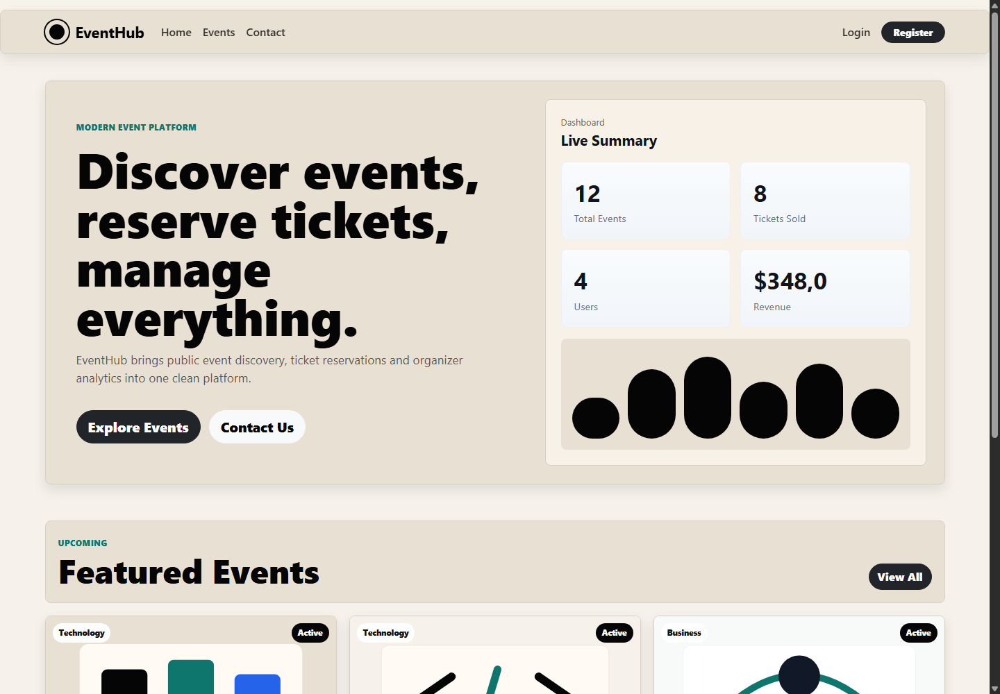
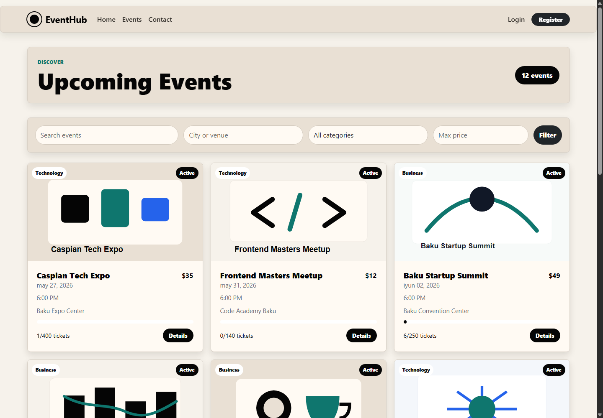

# EventHub

Advanced event management platform built with ASP.NET Core MVC, Entity Framework Core, Identity authentication and role-based authorization.

## Features

- Authentication with ASP.NET Identity
- Role-based access control: Admin, Organizer, User
- Event creation, editing and deletion
- Category management
- Ticket reservation with capacity checks
- Admin dashboard metrics: users, events, active events, registrations, revenue
- Search and filtering by title, location, category and price
- Responsive Bootstrap UI
- Local image upload for event covers
- Repository Pattern, Unit of Work, DTOs and service layer

## Screenshots

### Home page



### Events page



## Tech Stack

- .NET 10 / ASP.NET Core MVC
- Entity Framework Core
- SQL Server-ready configuration
- SQLite local fallback for easy demo runs
- ASP.NET Core Identity
- Bootstrap, HTML, CSS, JavaScript

## Demo Accounts

All seeded accounts use this password:

```text
EventHub123!
```

```text
admin@eventhub.local
organizer@eventhub.local
user@eventhub.local
```

## Run Locally

```bash
dotnet restore EventHub.slnx
dotnet build EventHub.slnx
dotnet run --project EventHub.Web/EventHub.Web.csproj --no-launch-profile --urls http://localhost:5088
```

Open:

```text
http://localhost:5088
```

## Database Provider

The project runs with SQLite by default so it works immediately on machines without SQL Server LocalDB.

To use SQL Server, update `EventHub.Web/appsettings.json`:

```json
{
  "DatabaseProvider": "SqlServer"
}
```

Then set `DefaultConnection` to your SQL Server connection string.

## Architecture

```text
EventHub.Web
в”њв”Ђв”Ђ Areas/Admin
в”њв”Ђв”Ђ Constants
в”њв”Ђв”Ђ Controllers
в”њв”Ђв”Ђ Data
в”њв”Ђв”Ђ DTOs
в”њв”Ђв”Ђ Interfaces
в”њв”Ђв”Ђ Models
в”њв”Ђв”Ђ Repositories
в”њв”Ђв”Ђ Services
в”њв”Ђв”Ђ ViewModels
в”њв”Ђв”Ђ Views
в””в”Ђв”Ђ wwwroot
```

