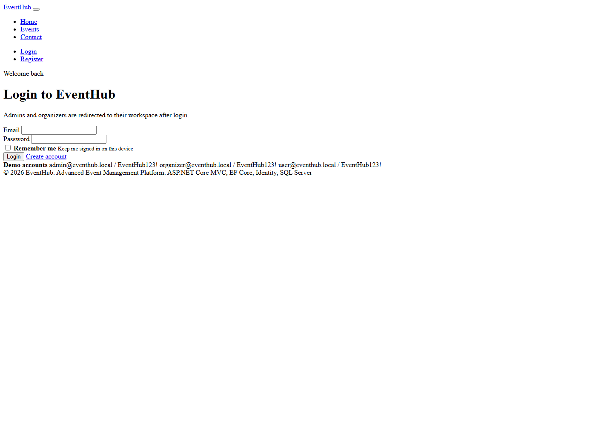
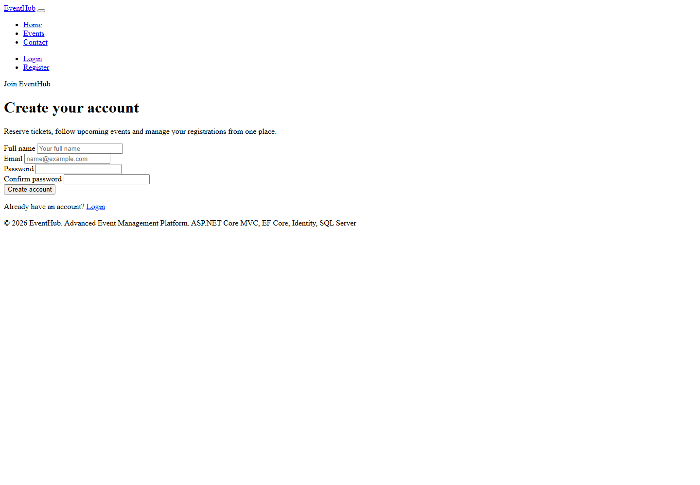

# EventHub

EventHub is a portfolio-ready event management platform built with ASP.NET Core MVC. It supports public event discovery, authentication, role-based dashboards, ticket reservation, and a personal ticket calendar backed by a real database.

## Screenshots

### Home


### Events


### Login



### Register



## Features

- User registration, login and logout with ASP.NET Identity
- Role-based access control for Admin, Organizer and User
- Public event listing with search and filters
- Event details page with ticket reservation
- User ticket calendar that shows purchased tickets by event date
- Organizer event management panel
- Admin dashboard with statistics and event insights
- Category management
- Local image upload support for event covers
- Seeded demo users, categories and events
- Responsive Eventopia-inspired UI design

## Tech Stack

- ASP.NET Core MVC / .NET 10
- Entity Framework Core
- SQLite database by default
- SQL Server-ready configuration
- ASP.NET Identity
- LINQ
- Repository Pattern and Unit of Work
- DTOs, ViewModels and Services
- Bootstrap, HTML, CSS and JavaScript

## Demo Accounts

All demo accounts use the same password:

```text
EventHub123!
```

```text
admin@eventhub.local
organizer@eventhub.local
user@eventhub.local
```

## Run Locally

```bash
dotnet restore EventHub.slnx
dotnet build EventHub.slnx
dotnet run --project EventHub.Web/EventHub.Web.csproj --no-launch-profile --urls http://localhost:5088
```

Open the app:

```text
http://localhost:5088
```

You can also run the helper script on Windows:

```powershell
.\run-eventhub.ps1
```

## Database

The project uses a real SQLite database by default:

```text
EventHub.Web/eventhub.db
```

The application stores users, roles, events, categories, registrations and ticket reservations in the database. `appsettings.json` only stores configuration, not application data.

To switch to SQL Server, update `EventHub.Web/appsettings.json`:

```json
{
  "DatabaseProvider": "SqlServer"
}
```

Then set `DefaultConnection` to your SQL Server connection string.

## Architecture

```text
EventHub.Web
├── Areas/Admin
├── Controllers
├── Data
├── DTOs
├── Interfaces
├── Models
├── Repositories
├── Services
├── ViewModels
├── Views
└── wwwroot
```

## Project Summary

EventHub demonstrates a clean MVC architecture with authentication, authorization, event management, ticket reservation, dashboard analytics and a database-backed calendar experience.
