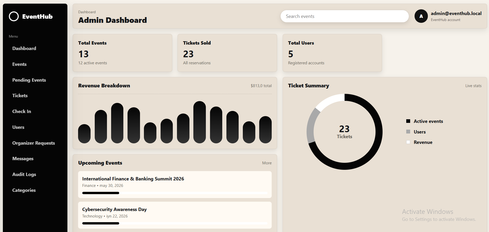
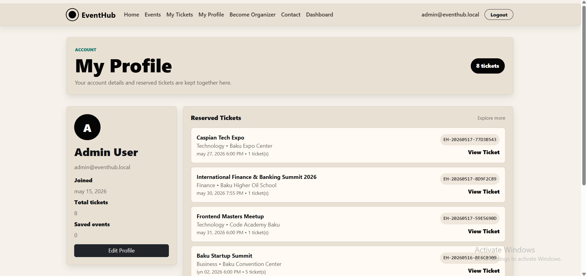
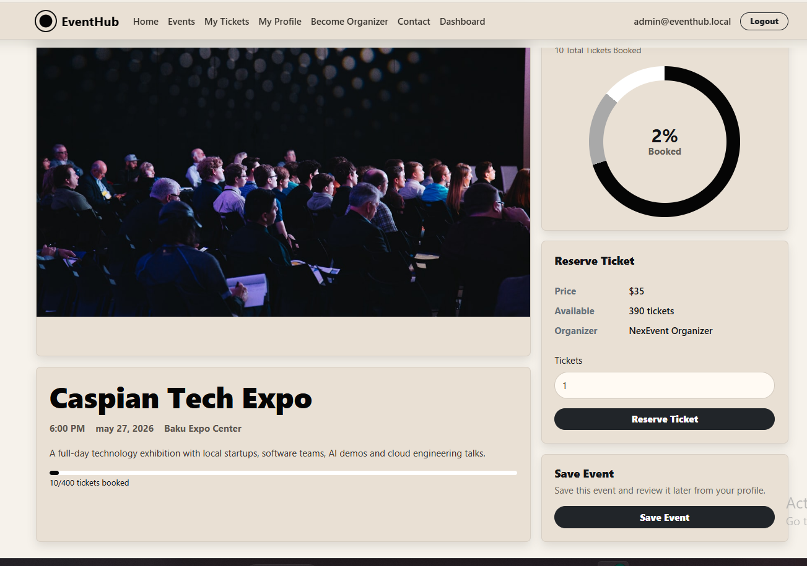

# EventHub

EventHub is a portfolio-ready event management and ticketing MVP built with ASP.NET Core MVC. It supports public event discovery, role-based workflows, organizer approvals, ticket reservation, QR-style check-in, support messages, AI-assisted admin replies and dashboard analytics backed by a real database.

## Screenshots

### Home


### Event Details



### User Profile



### Admin Dashboard



### Login


### Register


## Features

- ASP.NET Identity authentication: register, login, logout, forgot password, reset password and email confirmation token structure
- Role-based access control for `Admin`, `Organizer` and `User`
- Public event listing with search and filtering
- Event detail page with ticket reservation and saved event actions
- User profile with editable full name and phone number
- Saved events and personal ticket calendar
- Unique ticket codes with QR-style ticket detail page
- Admin ticket validation and check-in workflow
- Ticket lifecycle: `Reserved`, `CheckedIn`, `Cancelled`
- Organizer access request and admin approval workflow
- Organizer dashboard with event count, revenue, tickets sold and review queue
- Organizer event create, edit, image upload and management
- Event workflow: `PendingReview`, `Published`, `Rejected`, `Draft`
- Dedicated admin pending events review page with approve/reject notes
- Admin dashboard with platform statistics, registrations and category insights
- Admin users, tickets, categories, messages and audit logs
- Contact form stored in the database
- Admin reply workflow for contact messages with `Replied` status
- AI support assistant that generates professional reply drafts for admin messages
- CSV export for ticket reservations
- Responsive Eventopia-inspired beige/black UI
- Seeded demo users, categories and realistic event data

## Tech Stack

- ASP.NET Core MVC / .NET 10
- Entity Framework Core
- SQLite by default, SQL Server-ready configuration
- ASP.NET Identity
- LINQ
- Repository Pattern and Unit of Work
- DTOs, ViewModels and Services
- Bootstrap, HTML, CSS and JavaScript
- AI assistant abstraction through `IAiAssistantService`

## Demo Accounts

All demo accounts use the same password:

```text
EventHub123!
```

```text
admin@eventhub.local
organizer@eventhub.local
user@eventhub.local
```

## Run Locally

```bash
dotnet restore EventHub.slnx
dotnet build EventHub.slnx
dotnet run --project EventHub.Web/EventHub.Web.csproj --no-launch-profile --urls http://localhost:5088
```

Open the app:

```text
http://localhost:5088
```

Windows helper script:

```powershell
.\run-eventhub.ps1
```

## Database

The project uses a real SQLite database by default:

```text
EventHub.Web/eventhub.db
```

The application stores users, roles, events, categories, registrations, saved events, contact messages, organizer requests and audit logs in the database. `appsettings.json` stores configuration only.

To switch to SQL Server, update `EventHub.Web/appsettings.json`:

```json
{
  "DatabaseProvider": "SqlServer"
}
```

Then set `DefaultConnection` to your SQL Server connection string.

## AI Assistant

The admin support assistant is abstracted behind `IAiAssistantService`. The current implementation uses a template-based fallback so the project works without an API key. A real OpenAI or other provider integration can be added inside `AiAssistantService` without changing controllers or views.

```json
{
  "AiAssistant": {
    "Provider": "Template"
  }
}
```

## Architecture

```text
EventHub.Web
├── Areas
│   ├── Admin
│   └── Identity
├── Controllers
├── Data
├── DTOs
├── Interfaces
├── Models
├── Repositories
├── Services
├── ViewModels
├── Views
└── wwwroot
```

## CV Summary

EventHub is a role-based event management and ticketing platform built with ASP.NET Core MVC, Entity Framework Core and ASP.NET Identity. It includes organizer approval, event review workflows, ticket reservation, QR-style check-in, user profiles, saved events, admin dashboards, support message management, AI-assisted reply drafting, audit logs and CSV export using a clean MVC architecture.

## Demo Flow

See [docs/demo-flow.md](docs/demo-flow.md) for a step-by-step presentation script.
